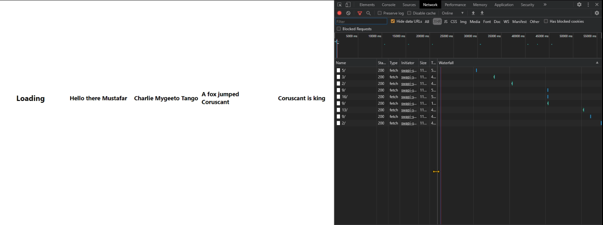

# Challenge

This application is challenge from Appfocused.



It shown 5 components that takes data from `server` with different time range and present it in different sentence.

To start application need to add data to props `timeRange` of all five components.

```jsx
<C1 timeRange="Put your code here" refreshInterval_Secs={60} />
```

and then run webpack server

```bash
npm run start
```

By default it will takes data from **DEV_SRV**, to switch server to **PROD_SVR** during Webpack compilation time need to set NODE_ENV.

One of the way in PowerShell
```bash
$env:NODE_ENV = 'production'
```

and then run webpack server

```bash
npm run start
```